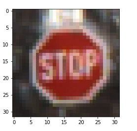
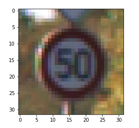
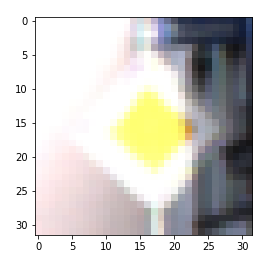
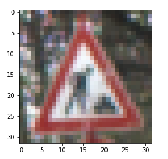
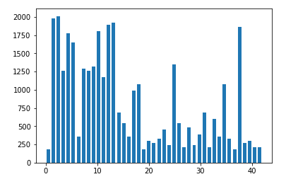
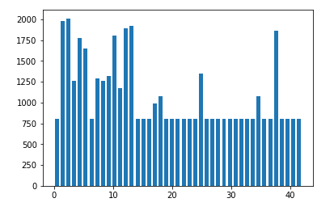
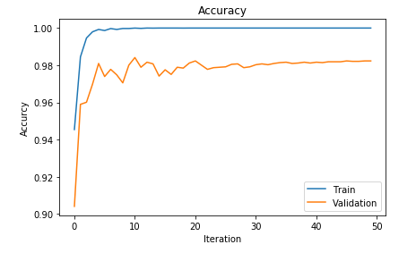
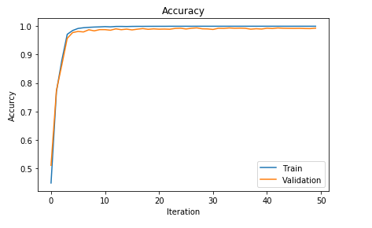
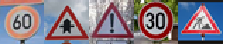

## Project: Build a Traffic Sign Recognition Program
Goal

•	Build deep convolution neuron network to classify traffic sign images

•	Achieve test accuracy larger than 0.93

Dataset Exploration
---
This project includes three datasets: training, validation, and testing datasets, and the size of each dataset is shown in the table.
Training	Validation	Testing
34799	4410	12630
For each single RBG image, the size is 32 pixels by 32 pixels.  Three sample images are shown below;

The total category number of traffic sign images is 43, the distribution of each traffic sign category for training dataset is shown below:

Data Preprocessing
Several data preprocessing methods are employed before the training process.
	Normalize traffic sign images.  For each image, divide each pixel value by 255, to make pixel values are in the range [0, 1]
	Subtract the mean for each image, to make sure the images have zero mean
	Convert the RGB images to grayscale images based on the following equation:
(R+G+B)/3
Data Augmentation
From the training data category distribution plot, different categories have large unbalanced data size.  So, data augmentation is employed to balance the data set and more data set will also make the training model more robust.
	Translation to the left, shift images to the left top corner with range [1, 8] pixel numbers for both x and y direction
	Translation to the right, shift images to the right bottom corner with range [1, 8] pixel numbers for both x and y direction
	Image tilt, tilt range is [-10, 10] degree
Each image randomly chooses one of transforms from the above three options and save the original and augmented data.  Each category should have at least 800 images.  The new training data and label information is saved as pickle file.  The new distribution plot of training dataset is shown below:

Model Architecture
Two model architectures are used during the training process.

Modified LeNet

	Input size	Output size	Kernel size	Stride size	Keep_prob
	
Conv 1	32, 32, 1	32, 32, 64	3, 3, 1, 64	1, 1, 1, 1	N

Relu	32, 32, 64	32, 32, 64	N	N	N

Max_pooling	32, 32, 64	16, 16, 64	1, 2, 2, 1	1, 2, 2, 1	N

Batch Norm	16, 16, 64	16, 16, 64	N	N	N

Conv 2	16, 16, 64	16, 16, 128	3, 3, 64, 128	1, 1, 1, 1	N

Relu	16, 16, 128	16, 16, 128	N	N	N

Max_pooling	16, 16, 128	8, 8, 128	1, 2, 2, 1	1, 2, 2, 1	N

Batch Norm	8, 8, 128	8, 8, 128	N	N	N

Conv 3	8, 8, 128	8, 8, 256	3, 3, 128, 256	1, 1, 1, 1	N

Relu	8, 8, 256	8, 8, 256	N	N	N

Max_pooling	8, 8, 256	4, 4, 256	1, 2, 2, 1	1, 2, 2, 1	N

Batch Norm	4, 4, 256	4, 4, 256	N	N	N

Conv 4	4, 4, 256	4, 4, 512	3, 3, 256, 512	1, 1, 1, 1	N

Relu	4, 4, 512	4, 4, 512	N	N	N

Max_pooling	4, 4, 512	2, 2, 512	1, 2, 2, 1	1, 2, 2, 1	N

Batch Norm	2, 2, 512	2, 2, 512	N	N	N

Flatten	2, 2, 512	2048	N	N	N

Fully connect	2048	120	N	N	N

Relu	120	120	N	N	N

Dropout	120	120	N	N	0.75

Batch Norm	120	120	N	N	N

Fully connect	120	84	N	N	N

Relu	84	84	N	N	N

Dropout	84	84	N	N	0.75

Batch Norm	84	84	N	N	N

Fully connect	84	43	N	N	N

VGGNet

	Input size	Output size	Kernel size	Stride size	Keep_prob
	
Conv 1	32, 32, 1	32, 32, 32	3, 3, 1,32	1, 1, 1, 1	N

Relu	32, 32, 32	32, 32, 32	N	N	N

Conv 2	32, 32, 32	32, 32, 32	3, 3, 32,32	1, 1, 1, 1	N

Relu	32, 32, 32	32, 32, 32	N	N	N

Max_pooling	32, 32, 32	16, 16, 32	1, 2, 2, 1	1, 2, 2, 1	N

dropout	16, 16, 32	16, 16, 32	N	N	0.5

Conv 3	16, 16, 32	16, 16, 64	3, 3, 32, 64	1, 1, 1, 1	N

Relu	16, 16, 64	16, 16, 64	N	N	N

Conv 4	16, 16, 64	16, 16, 64	3, 3, 64, 64	1, 1, 1, 1	N

Relu	16, 16, 64	16, 16, 64	N	N	N

Max_pooling	16, 16, 64	8, 8, 64	1, 2, 2, 1	1, 2, 2, 1	N

dropout	8, 8, 64	8, 8, 64	N	N	0.5

Conv 5	8, 8, 64	8, 8, 128	3, 3, 64, 128	1, 1, 1, 1	N

Relu	8, 8, 128	8, 8, 128	N	N	N

Conv 6	8, 8, 128	8, 8, 128	3, 3, 128, 128	1, 1, 1, 1	N

Relu	8, 8, 128	8, 8, 128	N	N	N

Max_pooling	8, 8, 128	4, 4, 128	1, 2, 2, 1	1, 2, 2, 1	N

dropout	4, 4, 128	4, 4, 128	N	N	0.5

flatten	4, 4, 128	2048	N	N	N

Fully connect	2048	128	N	N	N

Relu	128	128	N	N	N

Dropout	128	128	N	N	0.7

Fully connect	128	128	N	N	N

Relu	128	128	N	N	N

Dropout	128	128	N	N	0.7

Fully connect	128	43	N	N	N

Training parameter
LeNet

Batch Size	32

Optimizer	Adam

Training Epochs	50

Learning Rate	0.001 (Use learning rate decay)

Early Stop	No

VGGNet

Batch Size	64

Optimizer	Adam

Training Epochs	50

Learning Rate	0.001 (Use learning rate decay)

Early Stop	Yes

Training and test results
LeNet

Training accuracy	1

Validation accuracy	0.984

Testing accuracy	0.966

VGGNet

Training accuracy	1

Validation accuracy	0.994

Testing accuracy	0.978

Test on new images

Five new traffic sign images downloaded to test the model performance.

The actual category for each image from left to right is;

•	Speed limit (60 km/h) [3]

•	Right-of-way at the next intersection [11]

•	General caution [18]

•	Speed limit (30 km/h) [1]

•	Road work [25]

Based on the VGGNet model, the prediction results are [3, 11, 18, 1, 25], and the test accuracy is 1.  The output top 5 softmax probabilities for each image are shown below:
Top 5 predictions for each image:

Speed limit (60 km/h)	Right-of-way at the next intersection	General caution	Speed limit (30 km/h)	Road work

3	11	18	1	25

5	30	26	0	22

16	28	25	2	29

33	37	27	4	11

15	27	11	5	20
Corresponding probability for top 5 predictions for each image

Speed limit (60 km/h)	Right-of-way at the next intersection	General caution	Speed limit (30 km/h)	Road work

1.00000000e+00	1.00000000e+00	1.00000000e+00	1.00000000e+00	1.00000000e+00
7.22670469e-15	5.23105472e-16	7.04281078e-11	9.17219981e-11	1.34532814e-16
4.62976575e-20	1.58270256e-21	3.17348822e-14	6.18408802e-15	4.51197136e-20
4.94732605e-21	3.70903307e-24	1.79705595e-14	2.64603934e-16	3.33177042e-20
4.30839042e-21	8.41800328e-27	1.47142858e-16	1.22935831e-17	1.70197468e-20
